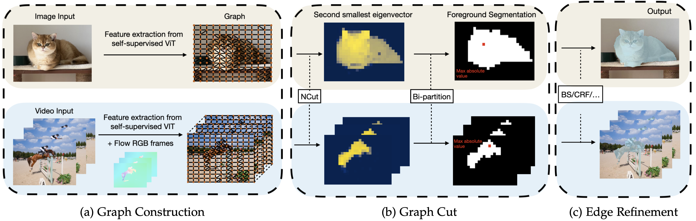
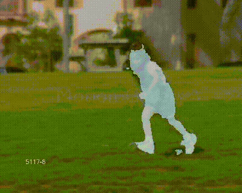
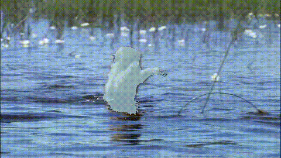

# TokenCut Video (extension of [TokenCut CVPR2022](https://github.com/YangtaoWANG95/TokenCut))
Pytorch implementation of **Tokencut** video section:

**TokenCut: Segmenting Objects in Images and Videos with Self-supervised Transformer and Normalized Cut**

*[Yangtao Wang](https://yangtaowang95.github.io), [Xi Shen](https://xishen0220.github.io/), [Yuan Yuan](https://yyuanad.github.io/), [Yuming Du](https://dulucas.github.io/Homepage/), [Maomao Li](https://scholar.google.com/citations?user=ym_t6QYAAAAJ&hl=zh-CN), [Shell Xu Hu](http://hushell.github.io/), , [James L. Crowley](http://crowley-coutaz.fr/jlc/jlc.html), [Dominique Vaufreydaz](https://research.vaufreydaz.org/)*


[[ Project page ](https://www.m-psi.fr/Papers/TokenCut2022/)]
[[ Github (Image Salient Object Detection) ](https://github.com/YangtaoWANG95/TokenCut)]
[[ Paper ]()]


<p align="center">
  
</p>

The project is an extension work to our CVPR work 
[Self-Supervised Transformers for Unsupervised Object Discovery using Normalized Cut
](https://arxiv.org/pdf/2202.11539.pdf).

If our project is helpful for your research, please consider citing : 
``` 
   @unpublished{wang2022tokencut2, 
	  title = {{TokenCut: Segmenting Objects in Images and Videos with Self-supervised Transformer 
		    and Normalized Cut}}, 
	  author = {Wang, Yangtao and Shen, Xi and Yuan, Yuan and Du, Yuming and Li, Maomao and 
		    Hu, Shell Xu and Crowley, James L and Vaufreydaz, Dominique}, 
	  url = {https://hal.archives-ouvertes.fr/hal-03765422}, 
	  note = {working paper or preprint}, 
	  year = {2022}, 
	  hal_id = {hal-03765422}, 
	  hal_version = {v1}
	}
```

## Table of Content
* [1. Updates](#1-updates)
* [2. Installation](#2-installation)
  * [2.1 Dependencies](#21-dependencies)
  * [2.2 Data](#22-data)
* [3. Quick Start](#3-quick-start)
* [4. Unsupervised video segmentation](#4-unsupervised-video-segmentation)
  * [4.1 Generate Segmentation](#41-generate-segmentation)
  * [4.2 Evaluation](#42-evaluation)
* [5. Acknowledgement](#5-acknowledgement)

## 1. Updates

***06/09/2022***
Initial commit: Code of TokenCut unsupervised video segmentation section is released.

## 2. Installation
### 2.1 Dependencies

This code was implemented with Python 3.8, PyTorch 1.9.0 and CUDA 11.2. Please refer to [the official installation](https://pytorch.org/get-started/previous-versions/). If CUDA 11.2 has been properly installed : 
```
pip install torch==1.9.0 torchvision==0.10.0
```


In order to install the additionnal dependencies, please launch the following command:

```
pip install -r requirements.txt
conda install -c conda-forge pydensecrf
```

### 2.2 Data

We provide quick download commands in [PREPARE_DATA.md](./PREPARE_DATA.md) for DAVIS, FBMS, SegTrackv2 as well as flow RGB representation generation.


## 3. Quick Start

We provide TokenCut visualization for single video, if the segmentation result is not very accurate, please chekck whether the optical flow results is clear enough, using gap > 1 to compensate small motions.
```
python quickstart.py --video_path ./figures/horsejump-high --gap 1
```
To build the graph on single frame, which is faster but less accurate:
```
python quickstart.py --video_path ./figures/horsejump-high --gap 1 --single-frame
```

## 4. Unsupervised video segmentation

### 4.1 Generate Segmentation

#### DAVIS
```
python main.py --out-dir /output/path --dataset DAVIS
```
#### FBMS
```
python main.py --out-dir /output/path --dataset FBMS --gap 3
```
#### SegTrackv2
```
python main.py --out-dir /output/path --dataset SegTrackv2
```

### 4.2 Evaluation
<table>
  <tr>
    <th>Method</th>
    <th>Flow</th>
    <th colspan="3">Dataset</th>
  </tr>
  <tr>
    <th></th>
    <th></th>
    <th>DAVIS</th>
    <th>FBMS</th>
    <th>SegTV2</th>
  </tr>
  <tr>
    <td>TokenCut</td>
    <td>RAFT</td>
    <td>64.3</td>
    <td>60.2</td>
    <td>59.6</td>
  <tr>
  <tr>
    <td>TokenCut+BS</td>
    <td>RAFT</td>
    <td>75.1</td>
    <td>61.2</td>
    <td>56.4</td>
  <tr>
  <tr>
    <td>TokenCut+CRF</td>
    <td>RAFT</td>
    <td><b>76.7</b></td>
    <td>66.6</td>
    <td><b>61.6</b></td>
  <tr>
  <tr>
    <td>TokenCut</td>
    <td>ARFlow</td>
    <td>62.0</td>
    <td>61.0</td>
    <td>58.9</td>
  <tr>
  <tr>
    <td>TokenCut+BS</td>
    <td>ARFlow</td>
    <td>73.1</td>
    <td>64.7</td>
    <td>54.6</td>
  <tr>
  <tr>
    <td>TokenCut+CRF</td>
    <td>ARFlow</td>
    <td>74.4</td>
    <td><b>69.0</b></td>
    <td>60.8</td>
  <tr>
</table>


#### Davis Evaluation API

Davis evaluation API is in `data/davis`, please find the instruction in `data/davis/README.md`

<p align="center">
  
  
</p>

#### FBMS

```
python eval.py --dataset FBMS --mask_dir /path/to/mask_data --gt_dir /path/to/FBMS/Annotations
```
<p align="center">
  
  
</p>

#### SegTrackv2

```
python eval.py --dataset SegTrackv2 --mask_dir /path/to/mask_data --gt_dir /path/to/SegTrackv2/GroundTruth
```

<p align="center">
  
  
</p>

## 5. Acknowledgement

TokenCut video code is built on top of [LOST](https://github.com/valeoai/LOST), [DINO](https://github.com/facebookresearch/dino), [Segswap](https://github.com/XiSHEN0220/SegSwap), [Bilateral_Sovlver](https://github.com/poolio/bilateral_solver), [MotionGrouping](https://github.com/charigyang/motiongrouping), [ARFlow](https://github.com/lliuz/ARFlow). We would like to sincerely thanks those authors for their great works. 
